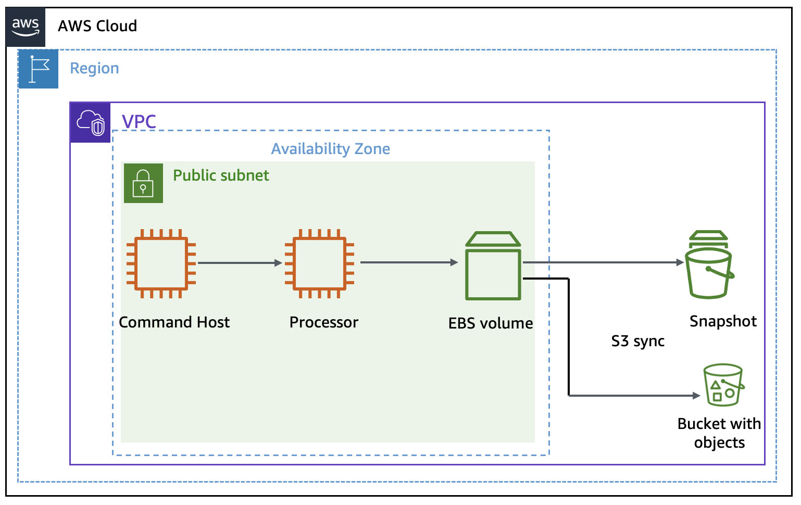
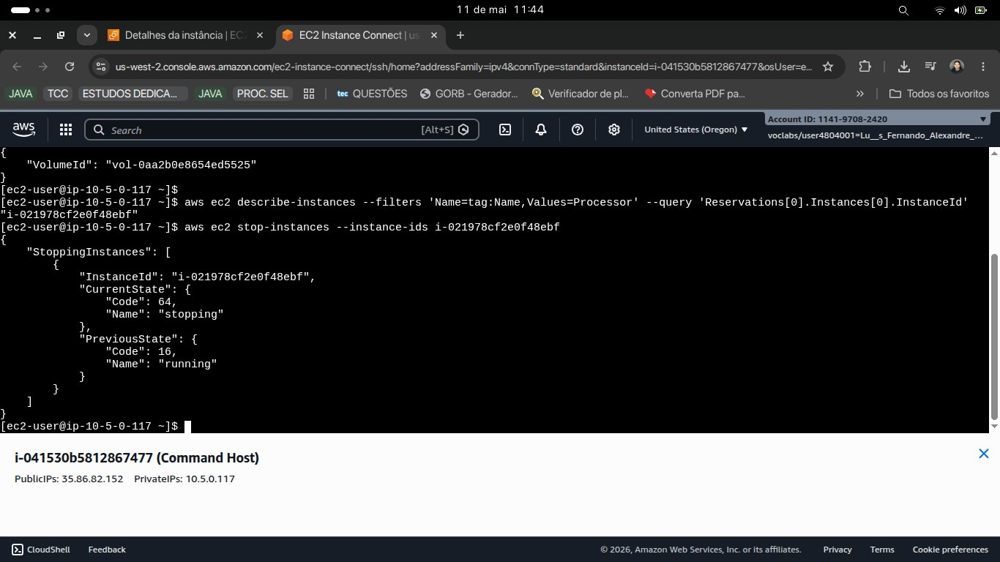
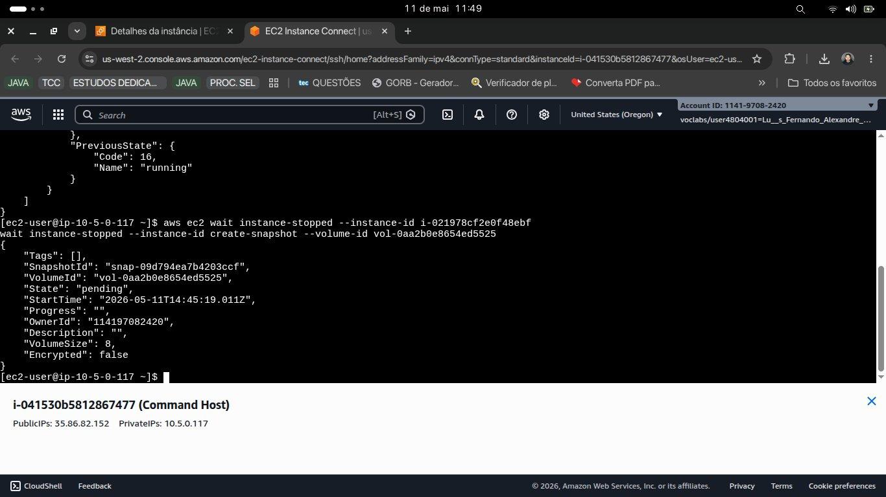
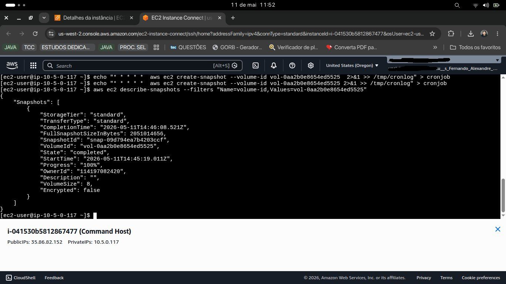
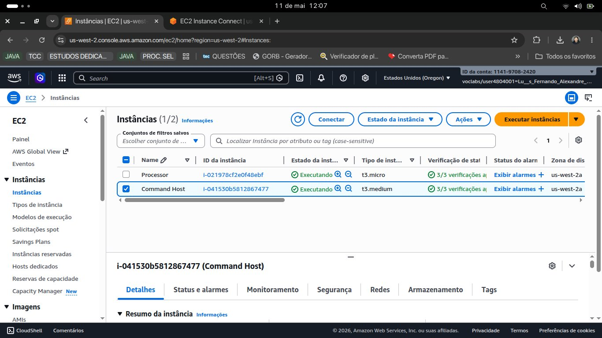
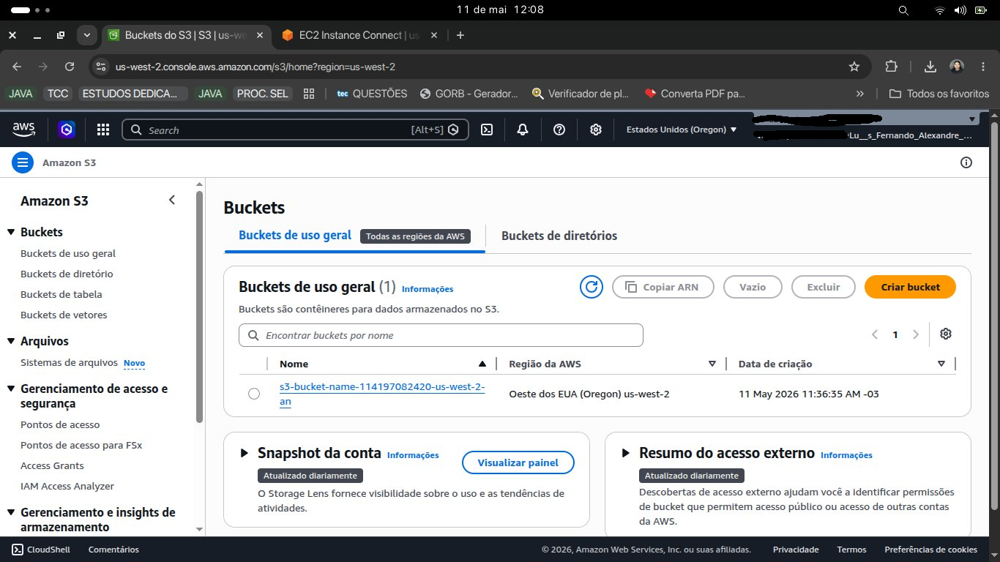
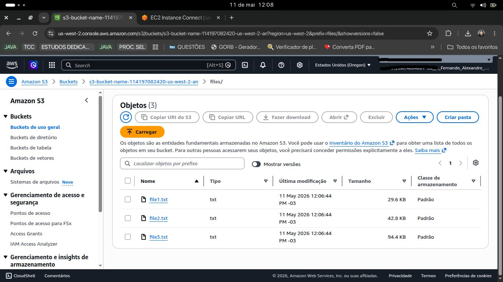
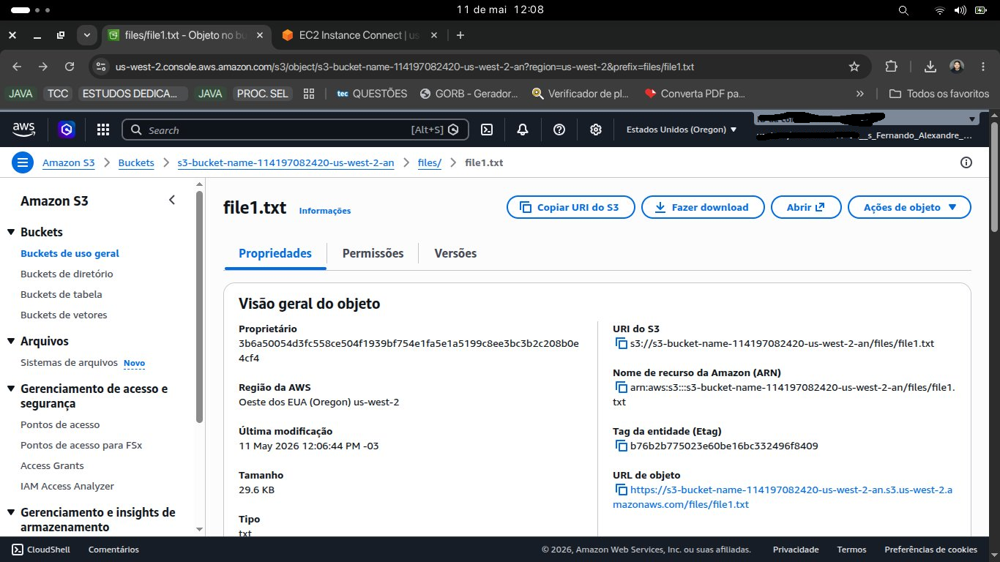

# 🗄️ AWS EBS & S3 Storage Management

> Laboratório prático de gerenciamento de armazenamento na AWS: snapshots automatizados de EBS com política de retenção via Python e sincronização inteligente com Amazon S3, incluindo versionamento e recuperação de arquivos.


---

## 📋 Visão Geral

Este projeto documenta a implementação de uma estratégia completa de **proteção e recuperação de dados na AWS**, executada 100% via **AWS CLI** a partir de uma instância EC2 (Command Host).

O ambiente simula um cenário real de produção: um servidor ativo (**Processor**) com volume EBS crítico, onde é necessário garantir backups automáticos, sincronização com armazenamento durável e capacidade de restauração sem perda de dados.

### Objetivos

- ✅ Automatizar snapshots do EBS com agendamento via `cron`
- ✅ Implementar política de retenção (manter apenas os 2 snapshots mais recentes)
- ✅ Sincronizar dados do EBS com Amazon S3
- ✅ Habilitar versionamento no S3 para proteção contra exclusões acidentais
- ✅ Demonstrar recuperação completa de arquivo deletado via version ID

---

## 🏗️ Arquitetura

```
┌─────────────────────────────────────────────────────────────────┐
│                        AWS VPC — us-west-2                      │
│                         Sub-rede Pública                        │
│                                                                 │
│   ┌──────────────────┐          ┌──────────────────────────┐   │
│   │   Command Host   │  AWS CLI │        Processor         │   │
│   │   (t3.medium)    │─────────▶│       (t3.micro)         │   │
│   └──────────────────┘          │                          │   │
│                                 │  ┌────────────────────┐  │   │
│                                 │  │  Volume EBS (8 GB) │  │   │
│                                 │  └─────────┬──────────┘  │   │
│                                 └────────────│─────────────┘   │
│                                              │                  │
│                    ┌─────────────────────────▼──────────┐      │
│                    │          Snapshots EBS              │      │
│                    │    (política: 2 mais recentes)      │      │
│                    └────────────────────────────────────┘      │
└─────────────────────────────────────────────────────────────────┘
                              │
                              │ aws s3 sync
                              ▼
              ┌───────────────────────────────┐
              │          Amazon S3            │
              │   s3://bucket/files/          │
              │   ├── file1.txt  (29.6 KB)    │
              │   ├── file2.txt  (42.8 KB)    │
              │   └── file3.txt  (94.4 KB)    │
              │                               │
              │   Versionamento: ✅ ATIVO     │
              └───────────────────────────────┘
```



---

## 🔧 O que foi Implementado

### Parte 1 — Snapshots Automatizados do EBS

| Etapa                | Comando                                       | Resultado                   |
| -------------------- | --------------------------------------------- | --------------------------- |
| Obter volume ID      | `describe-instances`                          | `vol-0aa2b0e8654ed5525`     |
| Parar instância      | `stop-instances` + `wait instance-stopped`    | Parada controlada           |
| Criar snapshot       | `create-snapshot` + `wait snapshot-completed` | `snap-09d794ea7b4203ccf`    |
| Automatizar          | `crontab` com job a cada minuto               | Múltiplos snapshots gerados |
| Política de retenção | `python3 snapshotter_v2.py`                   | Apenas 2 snapshots mantidos |

### Parte 2 — Sincronização EBS → S3 com Versionamento

| Etapa                   | Comando                                   | Resultado                  |
| ----------------------- | ----------------------------------------- | -------------------------- |
| Habilitar versionamento | `s3api put-bucket-versioning`             | Histórico de versões ativo |
| Sincronizar arquivos    | `aws s3 sync files s3://bucket/files/`    | 3 arquivos enviados        |
| Simular exclusão        | `rm files/file1.txt` + `s3 sync --delete` | Arquivo removido do S3     |
| Listar versões          | `s3api list-object-versions`              | Version ID localizado      |
| Restaurar arquivo       | `s3api get-object --version-id`           | `file1.txt` recuperado ✅  |
| Re-sincronizar          | `aws s3 sync`                             | Arquivo restaurado no S3   |

---

## 📸 Evidências de Execução

### 1. Parando a instância Processor e obtendo IDs



Instância `i-021978cf2e0f48ebf` interrompida de forma controlada antes da criação do snapshot.

---

### 2. Snapshot criado — estado `pending`



Snapshot `snap-09d794ea7b4203ccf` iniciado para o volume `vol-0aa2b0e8654ed5525`.

---

### 3. Snapshot concluído + cron job em execução



Snapshot com `"State": "completed"` e `"Progress": "100%"`. Cron job configurado para automação a cada minuto.

---

### 4. Instâncias EC2 em execução



Command Host (`t3.medium`) e Processor (`t3.micro`) ambos com status `Executando` e verificações aprovadas.

---

### 5. Bucket S3 criado



Bucket `s3-bucket-name-114197082420-us-west-2-an` criado na região `us-west-2` com versionamento ativado.

---

### 6. Arquivos sincronizados no S3



3 arquivos sincronizados com sucesso: `file1.txt` (29.6 KB), `file2.txt` (42.8 KB), `file3.txt` (94.4 KB).

---

### 7. `file1.txt` restaurado via versionamento



Arquivo `file1.txt` recuperado após exclusão acidental usando `s3api get-object --version-id`. **Zero perda de dados.**

---

## 💡 Principais Aprendizados

**Snapshots sem política de retenção viram custo.**
O script Python que mantém apenas os 2 snapshots mais recentes é essencial em produção — sem ele, snapshots se acumulam indefinidamente e geram cobrança.

**Versionamento no S3 é a diferença entre perda e recuperação.**
Um `aws s3 sync --delete` sem versionamento ativo seria irreversível. Com o versionamento habilitado, qualquer arquivo pode ser restaurado pelo seu `version-id`.

**CLI garante reprodutibilidade.**
Cada etapa executada via AWS CLI pode ser facilmente integrada a pipelines, scripts de IaC ou orquestrada com ferramentas como Airflow.

**Parar a instância antes do snapshot garante consistência.**
Snapshots de volumes em uso podem capturar estados inconsistentes. Interromper a instância antes é a abordagem correta para ambientes críticos.

---

## 🗂️ Estrutura do Repositório

```
aws-ebs-s3-storage-management/
├── assets/                     # Screenshots das etapas executadas
│   ├── 01-stop-instance-get-ids.png
│   ├── 02-create-snapshot-pending.png
│   ├── 03-snapshot-completed-cronjob.png
│   ├── 04-ec2-instances-running.png
│   ├── 05-s3-bucket-created.png
│   ├── 06-s3-files-synced.png
│   └── 07-s3-file1-restored-versioning.png
├── diagrams/
│   └── architecture.png        # Diagrama da arquitetura
├── snapshotter_v2.py           # Script Python de política de retenção
└── README.md
```

---

## 🔗 Contexto

Laboratório realizado como parte da formação prática em **AWS e Engenharia de Dados**, com foco em construir infraestrutura resiliente para pipelines de dados em produção.

Combina diretamente com o stack utilizado em projetos reais:

`Python` · `Apache Airflow` · `PostgreSQL` · `Docker` · `AWS`

---

## 👤 Autor

**Luis Fernando Alexandre dos Santos**  
Engenheiro de Dados | Mestrando em IA — UFERSA

[](https://www.linkedin.com/in/luisfernando-eng/)
[](https://github.com/luisFernandoJv)
