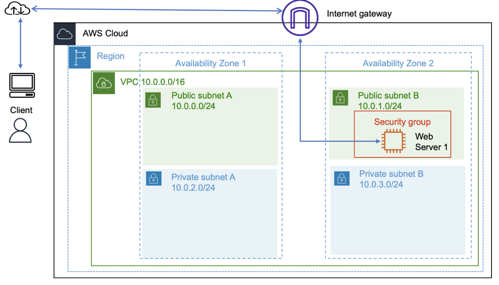
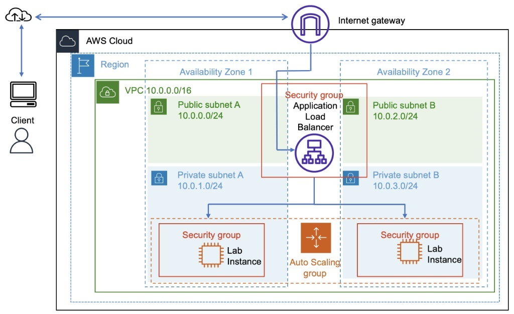
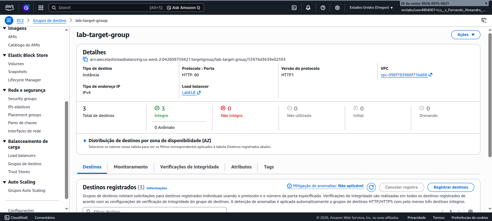
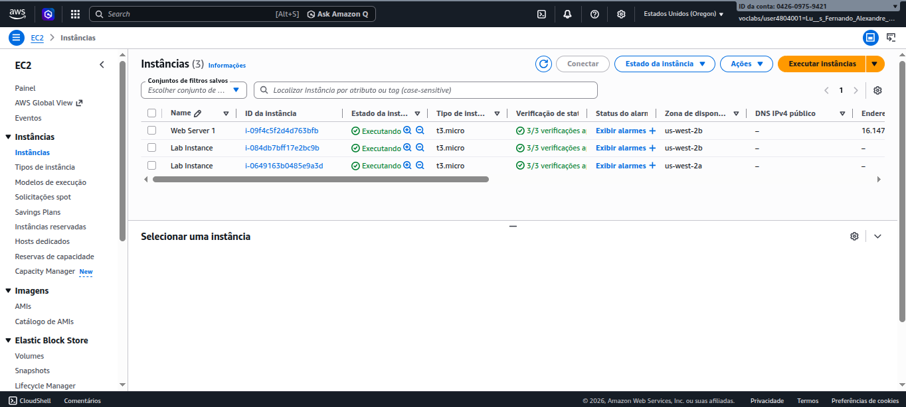
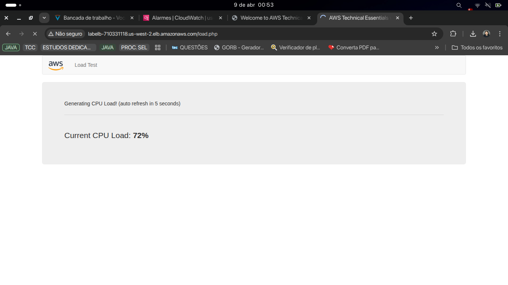
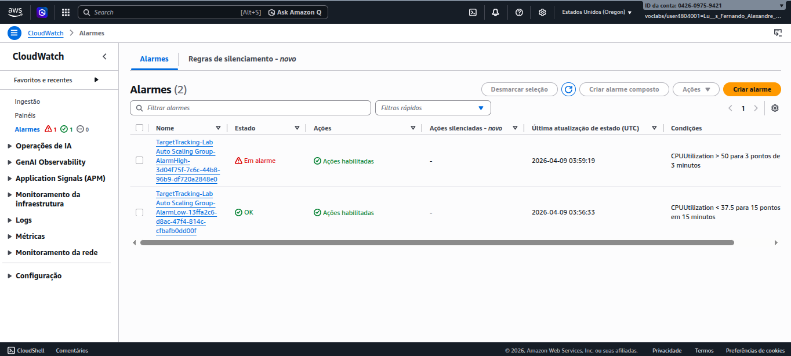
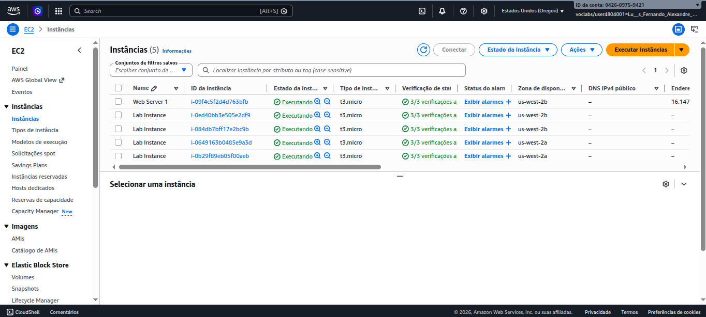

# ☁️ Arquitetura AWS: Alta Disponibilidade e Escalabilidade para APIs Backend

Este repositório documenta a evolução de uma infraestrutura de nuvem, saindo de um ambiente de servidor único (Single Point of Failure) para uma **arquitetura distribuída, segura e altamente disponível**.

Como Desenvolvedor Backend (Java/Spring Boot), o objetivo deste laboratório é dominar o ecossistema onde as aplicações rodam em produção, garantindo que a infraestrutura consiga escalar horizontalmente para suportar picos de tráfego sem degradação de performance.

---

## 🗺️ Evolução da Arquitetura (Antes e Depois)

### O Problema: Arquitetura Inicial

No cenário inicial, a aplicação residia em uma única instância EC2 localizada em uma sub-rede pública.

- **Riscos:** Se a zona de disponibilidade falhar ou a instância sobrecarregar, a aplicação cai. Além disso, o servidor web fica exposto diretamente à internet pública.

  

### A Solução: Arquitetura Final (Resiliente)

A arquitetura foi refatorada para isolar a camada de aplicação e distribuir a carga dinamicamente.

- **Segurança:** As instâncias EC2 agora rodam em **Sub-redes Privadas**. Apenas o Application Load Balancer (ALB) tem acesso à internet.
- **Resiliência:** O tráfego é distribuído entre múltiplas Zonas de Disponibilidade (Multi-AZ).
- **Escalabilidade:** O Auto Scaling Group monitora a saúde e a carga das máquinas, criando ou destruindo instâncias sob demanda.

  

---

## 🛠️ Tecnologias e Componentes AWS Utilizados

- **VPC & Networking:** Sub-redes Públicas (para o ALB) e Privadas (para o Backend).
- **Application Load Balancer (ALB):** Roteamento inteligente de tráfego HTTP e execução de _Health Checks_.
- **EC2 Auto Scaling Groups (ASG):** Gerenciamento de frota usando _Target Tracking Policies_.
- **Amazon CloudWatch:** Monitoramento de utilização de CPU e acionamento de métricas de expansão/redução.

---

## 🚀 Passo a Passo e Evidências da Implementação

Abaixo estão os testes práticos que comprovam o funcionamento da arquitetura.

### 1. Configuração do Target Group e Health Checks

O Load Balancer precisa saber se a aplicação Java está pronta para receber tráfego. O Target Group foi configurado para monitorar a saúde das instâncias na sub-rede privada.

  
   <em>Status: Instâncias íntegras e prontas para o balanceamento.</em>

### 2. Estado Base da Aplicação

O Auto Scaling foi configurado para manter uma base de **2 instâncias no mínimo**, garantindo a Alta Disponibilidade desde o momento zero.

  

### 3. Simulação de Pico de Tráfego (Stress Test)

Para testar a resiliência, foi gerada uma carga artificial na aplicação, elevando o consumo de processamento para simular um cenário de alto volume de requisições no backend.

  

### 4. Monitoramento e Ação do CloudWatch

O CloudWatch identificou que a média de CPU do cluster ultrapassou o gatilho estabelecido (**50%**) e disparou o status de alarme, notificando o Auto Scaling.

  

### 5. Escalonamento Horizontal Automático (Scale-Out)

Em resposta ao alarme, a infraestrutura provisionou automaticamente novas instâncias EC2. O Load Balancer imediatamente começou a direcionar parte do tráfego para essas novas máquinas, estabilizando o sistema.

  
   <em>A frota escalou automaticamente para distribuir a carga pesada.</em>

---

## 💡 Impacto no Desenvolvimento Backend (Java/Spring)

Construir essa infraestrutura reforça conceitos críticos para o desenvolvimento de software corporativo:

1. **APIs Stateless:** Como o Load Balancer distribui o tráfego dinamicamente para _qualquer_ instância, a aplicação Spring Boot não pode armazenar sessão na memória local (`HttpSession`). É necessário usar tokens JWT ou externalizar sessões (ex: Redis).
2. **Health Checks Confiáveis:** O endpoint de verificação (`/actuator/health` no Spring) deve ser leve, mas preciso, validando a conexão com o banco de dados para evitar que o Load Balancer envie tráfego para uma instância "morta".
3. **Tempos de Inicialização (Startup Time):** Em momentos de pico, novas instâncias precisam subir rápido. Aplicações pesadas demoram a entrar no ar, atrasando o Auto Scaling. Isso justifica otimizações arquiteturais e uso de imagens enxutas.

---

## 📞 Contato e Redes

Gostou do projeto ou quer trocar ideias sobre Cloud AWS, Java, Spring Boot e arquitetura de software? Fique à vontade para me contatar:

- 
- 
